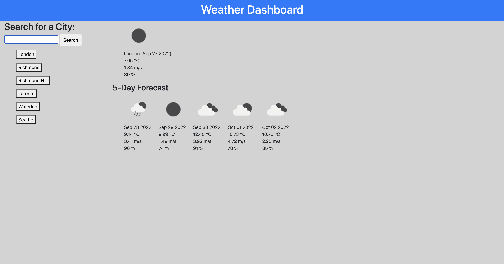

# 06-Server-Side-APIs-Challenge

Deployed URL: https://paksin.github.io/06-Server-Side-APIs-Challenge/

Third-party APIs allow developers to access their data and functionality by making requests with specific parameters to a URL. Developers are often tasked with retrieving data from another application's API and using it in the context of their own. This challenge is to build a weather dashboard that will run in the browser and feature dynamically updated HTML and CSS.

Through the use of [5 Day Weather Forecast](https://openweathermap.org/forecast5) to retrieve weather data for cities, user would be presented with the date, temperature, weather condition, wind speed, and humidity of that city. Also, search history would be stored through `localStorage` to store any persistent data and available to click underneath the search box.

For more information on how to work with the OpenWeather API, refer to the [Full-Stack Blog on how to use API keys](https://coding-boot-camp.github.io/full-stack/apis/how-to-use-api-keys).

